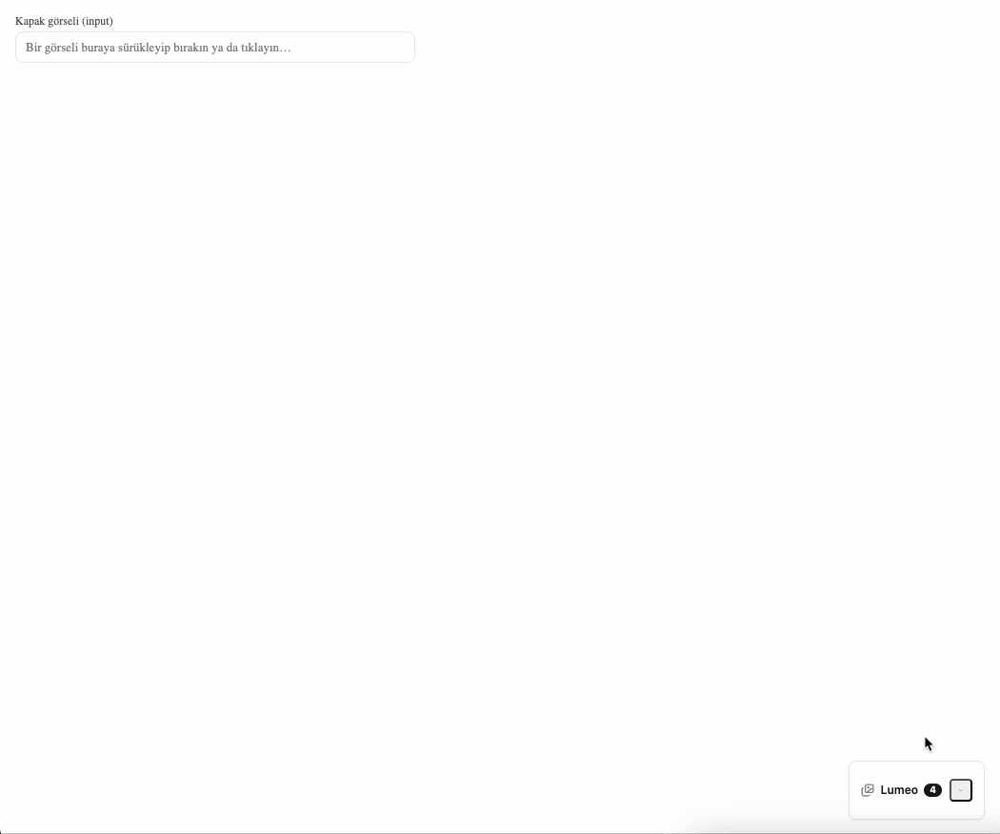

# eglador-lumeo

Drag & drop image upload, gallery, usage-type tagging, and dependency-free cropping toolkit for Next.js.

Author: [Umut Yaldız](https://github.com/umutyaldiz)

### Demo

**Upload → usage-type tagging → size presets → custom crop**, with `waitForSuccess: true` (live
save/list round trip against a mocked backend):


**Mini corner viewer** — embeddable widget with drag-and-drop export into an editor:



---

**Languages:** [English](#english) | [Türkçe](#türkçe) (scroll to the bottom)

---

## English

### Install

```bash
npm install eglador-lumeo
```

```tsx
// app/layout.tsx
import "eglador-lumeo/style.css";
```

### Usage

```tsx
"use client";
import { LumeoProvider, LumeoUploader, type LumeoConfig } from "eglador-lumeo";

const config: LumeoConfig = {
  endpoints: {
    upload: "/api/images/upload",
    list: "/api/images",
    save: "/api/images/save",
    delete: "/api/images/delete",
  },
  waitForSuccess: false,
  maxFileSizeMB: 10,
  accept: ["image/*"],
  // Opaque, consumer-supplied ids (site/tenant/project id, etc.) — string or number,
  // the package never interprets them, they're just forwarded on every request.
  clientId: "news-site-42",
  siteId: 42,
  // UI language for every built-in string. Default: "en". Set "tr" for Turkish.
  locale: "en",
};

export function MediaLibrary() {
  return (
    <LumeoProvider config={config}>
      <LumeoUploader />
    </LumeoProvider>
  );
}
```

### Authentication headers

For projects behind auth, `config.headers` adds extra headers to **every** request (list, upload,
save, delete) — a static object, or a function (sync or async) called fresh right before each
request, so a token read from storage is always current instead of captured once when the config
object was created:

```tsx
const config: LumeoConfig = {
  endpoints: { /* ... */ },
  headers: () => {
    const token = typeof window !== "undefined" ? localStorage.getItem("access_token") : null;
    const headers: Record<string, string> = {};
    if (token) headers["Authorization"] = `Bearer ${token}`;
    return headers;
  },
};
```

`config.headers` can also just be a plain `Record<string, string>` if the value never changes at
runtime. Either way, the resolved headers are merged into every request — on `save`/`delete` they
sit alongside the package's own `"Content-Type": "application/json"`.

### Customizing usage types and size presets

Both the "usage type" list (headline/cover/banner/...) and the size-preset list shown in the crop
modal are fully overridable from config — pass your own arrays and the built-in defaults are
skipped entirely:

```tsx
const config: LumeoConfig = {
  endpoints: { /* ... */ },
  imageTypes: [
    { value: "hero", label: "Hero Image", aspect: 21 / 9, width: 2560, height: 1097, cropTypeId: 101 },
    { value: "avatar", label: "Avatar", aspect: 1, width: 512, height: 512, cropTypeId: 102 },
  ],
  sizePresets: [
    { id: "square", width: 512, height: 512 },
    { id: "wide", width: 1600, height: 900, label: "1600×900 (Wide)" },
  ],
};
```

`imageTypes[].width`/`height` are optional and independent of `aspect` — when set, they're shown
next to the type's label in the usage-type selector (e.g. `21:9 · 2560×1097`) purely as a hint for
the editor; they don't change how the crop tool behaves (that's still driven by `aspect` alone).
`cropTypeId` is an optional opaque identifier (e.g. a backend/database id) distinct from the
slug-like `value` — when set, it's carried onto any `cropByUsageType` crop created for that type as
`CropRegion.cropTypeId`, alongside a derived `CropRegion.aspectRatio` ("WxH" slug, e.g. `"21x9"`) —
see "cropByUsageType için örnek uçtan uca akış" below for the full shape this produces.

#### Grouping usage types

Any `imageTypes` entry can nest other entries under it purely for display grouping — give it
`crops` (the same `LumeoImageTypeOption` shape, non-nested) and it renders as a heading over its
children instead of a button itself; only the children are selectable/croppable:

```tsx
imageTypes: [
  {
    name: "News",
    value: "news",
    label: "News",
    crops: [
      { value: "manset", label: "Headline", aspect: 16 / 9, cropTypeId: 1 },
      { value: "kapak", label: "Cover", aspect: 4 / 3, cropTypeId: 2 },
    ],
  },
  // Ungrouped entries still work exactly as before — mix and match freely.
  { value: "avatar", label: "Avatar", aspect: 1, cropTypeId: 102 },
],
```

The group's own `value` isn't selectable, but it isn't just decoration either: whenever a saved
type/crop came from inside that group, the group's `value` is sent back as a top-level `typeId`
field on the save request (alongside `clientId`, see "cropByUsageType için örnek uçtan uca akış").
`name` is the heading text shown above the group's buttons (falls back to `label` if omitted).

If omitted, `imageTypes` and `sizePresets` fall back to a locale-aware built-in default set
(English by default, Turkish when `locale: "tr"`).

#### Required usage types

`imageTypes[].required: true` marks an entry as required for a valid submission — the package
itself never blocks anything (no HTML `required`, no disabled buttons inside the modal); it only
exposes a **read-only status check** so your own app can act on it, e.g. disable your own save
button until every required type has been covered:

```tsx
imageTypes: [
  {
    name: "News",
    value: "news",
    label: "News",
    // Group-level required: satisfied only once EVERY ONE of its children has been used —
    // "both Headline and Cover", not just one of them.
    required: true,
    crops: [
      { value: "manset", label: "Headline", aspect: 16 / 9, cropTypeId: 1 },
      { value: "kapak", label: "Cover", aspect: 4 / 3, cropTypeId: 2 },
    ],
  },
  // Leaf-level required: this exact type specifically must be used.
  { value: "avatar", label: "Avatar", aspect: 1, cropTypeId: 102, required: true },
],
```

Crucially, this is checked **across the whole image list at once, not per image** — from your
example: 4 images uploaded, 4 different *leaf* types marked `required`, one different required
type cropped on each of the 4 images → every required type has a match somewhere in the list, so
the overall check is valid, even though no single image satisfies all 4 by itself.

**Ready-made display — `<LumeoRequiredStatus />`:** a drop-in component that renders a minimal
checklist of every `required` entry (colored per-child for groups, prefixed with the enclosing
group's name for an individually-required leaf) — and renders **nothing at all** when nothing in
`imageTypes` is marked `required`. Place it anywhere inside a `LumeoProvider`, it doesn't need to
be near `LumeoUploader`:

```tsx
import { LumeoRequiredStatus } from "eglador-lumeo";

<LumeoRequiredStatus />
```

It reads images through the same shared `useLumeoImages` cache as `LumeoUploader`/`ImageModal`, so
it updates automatically the instant a crop is saved anywhere in your app — no wiring required.
See it live in the `LumeoUploader / CropByUsageTypeDemo` story.

**Build your own:** use `checkRequiredImageTypes(images, imageTypes)` (a plain function) or the
reactive `useRequiredImageTypes(images, config)` hook — both exported from the package — outside
any Lumeo component, typically fed the same `images` your app already gets from `useLumeoImages`,
if you need a save button gated on `valid` or a custom look `LumeoRequiredStatus` doesn't cover.
Both
return `valid`, `missing` (the unsatisfied entries), and `statuses` — **every** `required` entry
(group or leaf) with its own `satisfied` flag, for rendering a full checklist rather than just an
overall message. A group status also carries `children`: the satisfied state of each of its
children individually, so a partially-covered group can show exactly which child is still
missing (e.g. "Cover" green, "Headline" red) even though the group's own `satisfied` only turns
`true` once every child does. A leaf required *individually* but still defined inside a group
(e.g. "Cover" required on its own, but still nested under a "News" group) carries `parent` — the
enclosing group option — so you can show that same origin, e.g. "News: Cover", for entries that
aren't themselves group requirements:

```tsx
import { useLumeoImages, useRequiredImageTypes } from "eglador-lumeo";

function PublishForm({ config }: { config: LumeoConfig }) {
  const { allImages } = useLumeoImages(config);
  const { valid, statuses } = useRequiredImageTypes(allImages, config);

  return (
    <>
      <ul>
        {statuses.map((status) => {
          const prefix = status.children
            ? (status.option.name ?? status.option.label)
            : status.parent && (status.parent.name ?? status.parent.label);
          return (
            <li key={String(status.option.value)}>
              {prefix && `${prefix}: `}
              {status.children ? (
                status.children.map((child) => (
                  <span key={String(child.option.value)} style={{ color: child.satisfied ? "green" : "crimson" }}>
                    {child.option.label}{" "}
                  </span>
                ))
              ) : (
                <span style={{ color: status.satisfied ? "green" : "crimson" }}>{status.option.label}</span>
              )}
            </li>
          );
        })}
      </ul>
      <button type="button" disabled={!valid} onClick={publish}>
        Publish
      </button>
    </>
  );
}
```

Prefer a single plain-text label instead (e.g. for a toast)? `formatRequiredEntryLabel(option)`
collapses a group and its children into one string, e.g. `"News (Headline, Cover)"`.

No manual refresh needed to keep this current: every `useLumeoImages` instance pointed at the
same list (same config) shares one live cache, so the moment the package's own
`LumeoUploader`/`ImageModal` saves a crop internally, this `images` array — and therefore
`valid`/`missing`/`statuses` — updates automatically (see the `LumeoUploader / CropByUsageTypeDemo`
story for a live example).

#### Grouped ("nested") size presets

A single `sizePresets` entry can expand to **multiple** output boxes while still appearing as one
selectable item in the "Size Options" tab — useful for a named bundle like "Detail" that should
always produce the same three crops together:

```tsx
sizePresets: [
  { id: "square", width: 512, height: 512 },
  {
    id: "detail",
    label: "Detail",
    sizes: [
      { width: 400, height: 400 },
      { width: 500, height: 200 },
      { width: 200, height: 200 },
    ],
  },
],
```

Selecting "Detail" toggles as a single checkbox (it counts as one selection in the tab badge), but
saving expands it into every box listed under `sizes` — see **(b)** under `endpoints.save` below
for the exact payload shape this produces.

### Localization (`locale`)

`config.locale` is `"en"` (default) or `"tr"`. It switches every built-in UI string (buttons,
labels, placeholders, empty states) and the default `imageTypes`/`sizePresets` labels, plus date
formatting (`en-US` vs `tr-TR`). The package ships only these two locales; anything else falls
back to English.

### API Schemas

Below are the exact request/response shapes your backend must implement for the 4 URLs in
`config.endpoints`. The package **never generates the `id` field itself** — it always expects it
from the API response.

If `config.clientId` and/or `config.siteId` are set, they're automatically attached to **every**
request as fully opaque values (each a `string` or a `number`, your choice) — the package never
interprets them, only forwards them:

- `upload`: added as `clientId`/`siteId` fields in the `multipart/form-data`
- `list`: added as `?clientId=...&siteId=...` query parameters
- `save` / `delete`: added as `clientId`/`siteId` fields in the JSON body

If `config.headers` is set, its resolved headers (see "Authentication headers" above) are merged
into all 4 requests too — most commonly an `Authorization` bearer token.

#### `LumeoImage` (shared data model across every endpoint)

```ts
interface LumeoImage {
  id: string;               // assigned by the API, required
  fileName: string;
  url: string;
  uploadedAt: string;        // ISO 8601, e.g. "2026-07-01T20:15:30.000Z"
  type?: string | number;    // e.g. "manset" | "kapak" | "banner" | "schema" | "thumbnail" | "galeri" — or a numeric id
  fileSize?: number;         // bytes
  mimeType?: string;         // e.g. "image/jpeg"
  width?: number;            // original pixel width, returned by the API after upload
  height?: number;           // original pixel height, returned by the API after upload
}
```

---

##### 1) `endpoints.upload` — `POST`

One or more files are sent in a **single request** as `multipart/form-data`. Every file is
appended under the same `files[]` field name (the trailing `[]` is the standard multipart array
convention — some backends, notably PHP, only see the last entry without it).

**Request (multipart/form-data):**

```
POST /api/images/upload
Content-Type: multipart/form-data; boundary=...

files[]: (binary) headline-image.jpg
files[]: (binary) cover-photo.png
clientId: news-site-42        (if config.clientId is set)
siteId: 42                    (if config.siteId is set)
```

**Expected response (200):**

```json
{
  "success": true,
  "images": [
    {
      "id": "img_9f1c2a",
      "fileName": "headline-image.jpg",
      "url": "https://cdn.example.com/uploads/img_9f1c2a.jpg",
      "uploadedAt": "2026-07-01T20:15:30.000Z",
      "fileSize": 245000,
      "mimeType": "image/jpeg",
      "width": 1920,
      "height": 1080
    },
    {
      "id": "img_9f1c2b",
      "fileName": "cover-photo.png",
      "url": "https://cdn.example.com/uploads/img_9f1c2b.png",
      "uploadedAt": "2026-07-01T20:15:30.000Z",
      "fileSize": 198000,
      "mimeType": "image/png",
      "width": 1200,
      "height": 800
    }
  ]
}
```

> Note: when `waitForSuccess: true`, the package only checks `response.ok` (HTTP 2xx) before
> refreshing the list once; it does not read `success`/`images` — those fields are your backend's
> actual source of truth, the package only decides based on the HTTP status. When
> `waitForSuccess: false`, the list is already refreshed without waiting for this response at all.

---

##### 2) `endpoints.list` — `GET`

**Request:**

```
GET /api/images
GET /api/images?clientId=news-site-42&siteId=42   (if config.clientId/siteId are set)
```

**Expected response (200)** — either shape is accepted:

```json
{
  "images": [
    {
      "id": "img_9f1c2a",
      "fileName": "headline-image.jpg",
      "url": "https://cdn.example.com/uploads/img_9f1c2a.jpg",
      "uploadedAt": "2026-07-01T20:15:30.000Z",
      "type": "manset",
      "fileSize": 245000,
      "mimeType": "image/jpeg",
      "width": 1920,
      "height": 1080
    }
  ]
}
```

or directly as an array:

```json
[
  {
    "id": "img_9f1c2a",
    "fileName": "headline-image.jpg",
    "url": "https://cdn.example.com/uploads/img_9f1c2a.jpg",
    "uploadedAt": "2026-07-01T20:15:30.000Z",
    "type": "manset",
    "width": 1920,
    "height": 1080
  }
]
```

---

##### 3) `endpoints.save` — `POST`

Fired when the user clicks "Save" in the image modal. The body depends on which tab the user
used; `sizes` and `crops` are **both optional and only sent if the user made a selection in that
tab**.

**a) Only a type was selected (resize/crop was never opened):**

```json
{
  "id": "img_9f1c2a",
  "type": "manset"
}
```

**b) One or more preset sizes were picked from the "Size Options" tab** (no manual area selection,
just target dimensions). Each selected preset is normalized to the same shape — an `id`, a
`label`, and a `sizes` array of the concrete output boxes it expands to. A plain preset always
expands to exactly one box; a grouped/"nested" preset (see above) expands to several, all under
the single `id`/`label` the user actually selected:

```json
{
  "id": "img_9f1c2a",
  "type": "manset",
  "sizes": [
    { "id": "1024x768", "label": "1024x768", "sizes": [{ "width": 1024, "height": 768, "label": "1024x768" }] },
    { "id": "400x400", "label": "400x400", "sizes": [{ "width": 400, "height": 400, "label": "400x400" }] },
    {
      "id": "detail",
      "label": "Detail",
      "sizes": [
        { "width": 400, "height": 400, "label": "400×400" },
        { "width": 500, "height": 200, "label": "500×200" },
        { "width": 200, "height": 200, "label": "200×200" }
      ]
    }
  ]
}
```

**c) One or more regions were manually selected from the "Custom Crop" tab** — coordinates are in
the original image's natural pixel space, `x`/`y` from the top-left corner:

```json
{
  "id": "img_9f1c2a",
  "type": "manset",
  "crops": [
    {
      "id": "c1a2b3c4-...",
      "name": "Crop 1",
      "aspectLabel": "16:9",
      "aspect": 1.7778,
      "aspectRatio": "16x9",
      "x": 120,
      "y": 340,
      "width": 1024,
      "height": 576
    }
  ]
}
```

**d) If both tabs were used**, `sizes` and `crops` are sent together (b + c combined).

> If `config.clientId`/`config.siteId` are set, `"clientId": "news-site-42"`/`"siteId": 42` fields
> are automatically added to all of the bodies above.

**Expected response (200):**

```json
{ "success": true }
```

**What your backend should do with `sizes` / `crops`:** each box is a request for a **new derived
output**, not a mutation of the original image. For every entry in `crops`, and for every box
inside every `sizes[].sizes`, generate the resized/cropped file (using that box's `width`/`height`,
or the `crops[].x/y/width/height` region cut from the original) and persist it as its **own**
`LumeoImage` record — its own `id`, its own `url`. Iterate `sizes[].sizes`, not `sizes` itself: a
plain preset's array has one box, but a grouped preset like "Detail" has several, and all of them
need to be produced even though the user only ticked one checkbox. The original image record is
left untouched (only `type` is updated on it, if sent). The package itself does nothing more than
send this payload and refetch `list` right after — it never reads or interprets `sizes`/`crops`
beyond that, so this behavior is entirely up to your backend.

Concretely, after payload **(b)** above (two plain presets plus the "Detail" group picked), the
very next `GET list` call is expected to include five brand new entries — two for the plain
presets, three for "Detail" — alongside the untouched original:

```json
{
  "images": [
    {
      "id": "img_9f1c2a",
      "fileName": "headline-image.jpg",
      "url": "https://cdn.example.com/uploads/img_9f1c2a.jpg",
      "uploadedAt": "2026-07-01T20:15:30.000Z",
      "type": "manset",
      "width": 1920,
      "height": 1080
    },
    {
      "id": "img_9f1c2a_1024x768",
      "fileName": "headline-image (1024x768).jpg",
      "url": "https://cdn.example.com/uploads/img_9f1c2a_1024x768.jpg",
      "uploadedAt": "2026-07-01T20:16:02.000Z",
      "width": 1024,
      "height": 768
    },
    {
      "id": "img_9f1c2a_400x400",
      "fileName": "headline-image (400x400).jpg",
      "url": "https://cdn.example.com/uploads/img_9f1c2a_400x400.jpg",
      "uploadedAt": "2026-07-01T20:16:02.000Z",
      "width": 400,
      "height": 400
    },
    {
      "id": "img_9f1c2a_detail_400x400",
      "fileName": "headline-image (400×400).jpg",
      "url": "https://cdn.example.com/uploads/img_9f1c2a_detail_400x400.jpg",
      "uploadedAt": "2026-07-01T20:16:02.000Z",
      "width": 400,
      "height": 400
    },
    {
      "id": "img_9f1c2a_detail_500x200",
      "fileName": "headline-image (500×200).jpg",
      "url": "https://cdn.example.com/uploads/img_9f1c2a_detail_500x200.jpg",
      "uploadedAt": "2026-07-01T20:16:02.000Z",
      "width": 500,
      "height": 200
    },
    {
      "id": "img_9f1c2a_detail_200x200",
      "fileName": "headline-image (200×200).jpg",
      "url": "https://cdn.example.com/uploads/img_9f1c2a_detail_200x200.jpg",
      "uploadedAt": "2026-07-01T20:16:02.000Z",
      "width": 200,
      "height": 200
    }
  ]
}
```

`src/mocks/handlers.ts` implements exactly this behavior (including expanding grouped presets like
"Detail" into one output per nested box) and backs the `ImageModal / SaveUpdatesTheList` and
`ImageModal / NestedSizePreset` Storybook stories — open them to see the full round trip live.

---

##### 4) `endpoints.delete` — `DELETE`

**Request:**

```json
{ "id": "img_9f1c2a", "clientId": "news-site-42", "siteId": 42 }
```

(Sent via the `DELETE` method with a `Content-Type: application/json` body. The `clientId`/`siteId`
fields are only added if `config.clientId`/`config.siteId` are set.)

**Expected response (200):**

```json
{ "success": true }
```

---

For all 4 endpoints, the package only checks `response.ok` (the HTTP status code); a `success`
field is not required but recommended for readability. See `src/mocks/handlers.ts` for a working
mock server example.

### Next.js helper hook

```tsx
"use client";
import { useLumeoImages } from "eglador-lumeo";

function HeadlineImages() {
  const { images, loading, refetch } = useLumeoImages(config, { type: "manset" });
  // ...
}
```

### Mini corner viewer

```tsx
<LumeoMiniViewer corner="bottom-right" onImageClick={(image) => insertIntoEditor(image)} />
```

By default the viewer is `position="fixed"`, pinned to a viewport corner via `corner`. Pass
`position="static"` to embed it as a normal in-flow element inside any container you control —
position and size it with your own CSS:

```tsx
<div className="sidebar">
  <LumeoMiniViewer position="static" onImageClick={(image) => insertIntoEditor(image)} />
</div>
```

#### Dragging thumbnails into an editor

Pass `dragData` to make thumbnails draggable. `pattern` is a template string with a placeholder
token (default `"{value}"`, override via `placeholder`) that gets replaced with whatever
`getValue` returns (default: `image.id`). The result is written to `event.dataTransfer` under
`format` (default `"text/plain"`) on `dragstart`, ready for any drop target to read.

```tsx
<LumeoMiniViewer
  onImageClick={(image) => insertIntoEditor(image)}
  dragData={{
    pattern: "#resim#[RESIMID]#",
    placeholder: "[RESIMID]",
    getValue: (image) => image.id,
  }}
/>
```

**Lexical editor:** register a plugin that reads the same `format` on drop and inserts it as
text. A copy-pasteable reference implementation lives at
[`src/stories/lexical/ImageDropPlugin.tsx`](src/stories/lexical/ImageDropPlugin.tsx) (not
published with the package — copy it into your app) and is wired up end-to-end in the
`LumeoMiniViewer / EmbeddedWithLexicalEditor` Storybook story, which drags a thumbnail into a
real `LexicalComposer` editor and drops in the configured pattern.

#### Keeping it mounted across tabs/navigation

`LumeoMiniViewer` only stays visible while it's actually mounted — `position="fixed"` pins it to
the viewport, but that's moot if your own app's tab/route switching unmounts the part of the tree
it lives in. If you render it inside one tab of a larger app (e.g. a "Media" tab) and it
disappears when you switch to another tab, render it **outside** the tab-switching logic instead
— at the layout level that wraps every tab — so it stays mounted no matter which tab is active:

```tsx
function AppLayout() {
  return (
    <LumeoProvider config={config}>
      <Tabs>
        <TabPanel name="media"><MediaTab /></TabPanel>
        <TabPanel name="other"><OtherTab /></TabPanel>
      </Tabs>

      {/* Outside the tab switch — stays mounted regardless of which tab is active. */}
      <LumeoMiniViewer corner="bottom-right" defaultCollapsed onImageClick={(image) => /* ... */ null} />
    </LumeoProvider>
  );
}
```

If you already do this and it still disappears, check whether your tab-transition library
(Framer Motion, `react-transition-group`, etc.) applies `transform`/`filter`/`will-change` to an
ancestor of the widget — any of those create a new containing block for `position: fixed`
descendants, so the widget ends up positioned relative to that ancestor instead of the viewport
and disappears when the ancestor animates out or is hidden. Move the widget outside that
transformed ancestor (e.g. via a portal) if so.

### Development

```bash
npm install
npm run storybook   # explore every component with mocked API responses
npm run build       # tsup + tailwind CSS build -> dist/
npm run typecheck
```

---

## Türkçe

### Kurulum

```bash
npm install eglador-lumeo
```

```tsx
// app/layout.tsx
import "eglador-lumeo/style.css";
```

### Kullanım

```tsx
"use client";
import { LumeoProvider, LumeoUploader, type LumeoConfig } from "eglador-lumeo";

const config: LumeoConfig = {
  endpoints: {
    upload: "/api/images/upload",
    list: "/api/images",
    save: "/api/images/save",
    delete: "/api/images/delete",
  },
  waitForSuccess: false,
  maxFileSizeMB: 10,
  accept: ["image/*"],
  // Opaque, sizin tanımladığınız kimlikler (site/tenant/proje id vb.) — string ya da
  // number olabilir, paket bunları yorumlamaz, sadece her isteğe aynen ekler.
  clientId: "news-site-42",
  siteId: 42,
  // Tüm hazır arayüz metinlerinin dili. Varsayılan: "en". Türkçe için "tr" verin.
  locale: "tr",
};

export function MediaLibrary() {
  return (
    <LumeoProvider config={config}>
      <LumeoUploader />
    </LumeoProvider>
  );
}
```

### Kimlik doğrulama header'ları

Auth gerektiren projeler için `config.headers`, **her** isteğe (list, upload, save, delete) ekstra
header ekler — sabit bir obje olabilir, ya da (senkron veya async) bir fonksiyon olabilir; bu
fonksiyon her istekten hemen önce tekrar çağrılır, böylece storage'dan okunan bir token config
oluşturulduğu anda değil, her seferinde güncel haliyle gönderilir:

```tsx
const config: LumeoConfig = {
  endpoints: { /* ... */ },
  headers: () => {
    const token = typeof window !== "undefined" ? localStorage.getItem("access_token") : null;
    const headers: Record<string, string> = {};
    if (token) headers["Authorization"] = `Bearer ${token}`;
    return headers;
  },
};
```

`config.headers`, çalışma zamanında hiç değişmeyecekse düz bir `Record<string, string>` da
olabilir. Her iki durumda da çözümlenen header'lar her isteğe eklenir — `save`/`delete`'te
paketin kendi `"Content-Type": "application/json"` header'ıyla birlikte gönderilir.

### Kullanım tipi ve boyut seçeneklerini özelleştirme

Hem "kullanım tipi" listesi (manşet/kapak/banner/...) hem de kırpma modalinde gösterilen boyut
seçenekleri listesi tamamen config üzerinden özelleştirilebilir — kendi dizinizi verirseniz
hazır varsayılanlar tamamen devre dışı kalır:

```tsx
const config: LumeoConfig = {
  endpoints: { /* ... */ },
  imageTypes: [
    { value: "hero", label: "Ana Görsel", aspect: 21 / 9, width: 2560, height: 1097, cropTypeId: 101 },
    { value: "avatar", label: "Avatar", aspect: 1, width: 512, height: 512, cropTypeId: 102 },
  ],
  sizePresets: [
    { id: "square", width: 512, height: 512 },
    { id: "wide", width: 1600, height: 900, label: "1600×900 (Geniş)" },
  ],
};
```

`imageTypes[].width`/`height` opsiyoneldir ve `aspect`'ten bağımsız çalışır — verildiğinde,
kullanım tipi seçicisinde etiketin yanında (ör. `21:9 · 2560×1097`) editöre yardımcı bir bilgi
olarak gösterilir; kırpma aracının davranışını değiştirmez (o hâlâ sadece `aspect`'e bağlıdır).
`cropTypeId`, slug niteliğindeki `value`'dan ayrı, opsiyonel bir tanımlayıcıdır (ör.
backend/veritabanı id'si) — verildiğinde, o tip için `cropByUsageType` ile oluşturulan her kadrajın
üzerine `CropRegion.cropTypeId` olarak taşınır; ayrıca her kadrajda otomatik olarak bir
`CropRegion.aspectRatio` ("WxH" formatında, ör. `"21x9"`) da bulunur — tam şeklini aşağıdaki
"cropByUsageType için örnek uçtan uca akış" bölümünde görebilirsiniz.

#### Kullanım tiplerini gruplama

Herhangi bir `imageTypes` girdisi, sadece görüntüde gruplamak amacıyla başka girdileri içine
nest edebilir — `crops` verin (aynı `LumeoImageTypeOption` şekli, nested olmayan) ve o girdi kendisi
buton olarak değil, altındaki çocukların üzerinde bir başlık olarak render edilir; sadece
çocukları seçilebilir/kırpılabilir olur:

```tsx
imageTypes: [
  {
    name: "Haberler",
    value: "haberler",
    label: "Haberler",
    crops: [
      { value: "manset", label: "Manşet", aspect: 16 / 9, cropTypeId: 1 },
      { value: "kapak", label: "Kapak", aspect: 4 / 3, cropTypeId: 2 },
    ],
  },
  // Nested olmayan girdiler eskisi gibi çalışmaya devam eder — karıştırıp eşleştirebilirsiniz.
  { value: "avatar", label: "Avatar", aspect: 1, cropTypeId: 102 },
],
```

Grubun kendi `value`'su seçilebilir değildir ama sadece dekoratif de değildir: kaydedilen
tip/kadraj o grubun içinden geldiyse, grubun `value`'su kaydetme isteğinde `clientId` ile aynı
katmanda, üst seviye bir `typeId` alanı olarak geri gönderilir (bkz. "cropByUsageType için örnek
uçtan uca akış"). `name`, grubun butonlarının üzerinde gösterilen başlık metnidir (verilmezse
`label`'a düşer).

`imageTypes` ve `sizePresets` verilmezse, dile göre (locale) değişen hazır bir varsayılan sete
düşer (varsayılan olarak İngilizce, `locale: "tr"` verildiğinde Türkçe).

#### Zorunlu kullanım tipleri

`imageTypes[].required: true`, bir girdiyi geçerli bir gönderim için zorunlu olarak işaretler —
paketin kendisi hiçbir şeyi engellemez (ne HTML `required`, ne modal içinde pasifleşen bir buton);
sadece **salt okunur bir durum kontrolü** sunar, kendi uygulamanız bunu kullanarak örneğin kendi
kaydet butonunuzu, tüm zorunlu tipler karşılanana kadar pasif tutabilirsiniz:

```tsx
imageTypes: [
  {
    name: "Haberler",
    value: "haberler",
    label: "Haberler",
    // Grup seviyesinde zorunluluk: çocukların HEPSİ kullanıldığında karşılanır —
    // "Manşet VE Kapak'ın ikisi de", sadece biri değil.
    required: true,
    crops: [
      { value: "manset", label: "Manşet", aspect: 16 / 9, cropTypeId: 1 },
      { value: "kapak", label: "Kapak", aspect: 4 / 3, cropTypeId: 2 },
    ],
  },
  // Yaprak (leaf) seviyesinde zorunluluk: özellikle bu tam tip kullanılmış olmalı.
  { value: "avatar", label: "Avatar", aspect: 1, cropTypeId: 102, required: true },
],
```

Önemli nokta: bu kontrol **tüm görsel listesi genelinde bir kerede** yapılır, imaj başına değil —
sizin örneğinizden gidersek: 4 görsel yüklü, 4 farklı *yaprak* tip `required` olarak işaretli, 4
görselin her birinde 1'er farklı zorunlu tip kadrajlanmış → her zorunlu tipin listenin bir yerinde
bir eşleşmesi var, dolayısıyla genel kontrol geçerli (valid) olur — hiçbir tek görsel 4'ünü birden
karşılamasa bile.

**Hazır görüntüleme — `<LumeoRequiredStatus />`:** her `required` girdiyi minimal bir kontrol
listesi olarak render eden hazır bir bileşen (gruplarda her çocuk ayrı renklenir, tek başına
zorunlu ama bir grubun içindeki bir yaprak o grubun adıyla önceden gösterilir) — `imageTypes`'ta
hiçbir şey `required` değilse **hiçbir şey render etmez**. Herhangi bir `LumeoProvider`'ın içine
yerleştirin, `LumeoUploader`'a yakın olması gerekmez:

```tsx
import { LumeoRequiredStatus } from "eglador-lumeo";

<LumeoRequiredStatus />
```

`LumeoUploader`/`ImageModal` ile aynı paylaşımlı `useLumeoImages` önbelleğini okur, bu yüzden
uygulamanızın herhangi bir yerinde bir kadraj kaydedildiği an otomatik güncellenir — ayrıca
kablolama gerekmez. Canlı örneği `LumeoUploader / CropByUsageTypeDemo` story'sinde görebilirsiniz.

**Kendi tasarımınızı yapın:** paketten export edilen `checkRequiredImageTypes(images, imageTypes)`
(düz bir fonksiyon) veya reaktif `useRequiredImageTypes(images, config)` hook'unu — herhangi bir
Lumeo bileşeninin dışında, tipik olarak uygulamanızın zaten `useLumeoImages`'tan aldığı aynı
`images`'ı vererek — `valid`'e bağlı bir kaydet butonu veya `LumeoRequiredStatus`'un kapsamadığı
özel bir görünüm isterseniz kullanın. İkisi de `valid`, `missing` (karşılanmamış girdiler) ve `statuses` döner — **her** `required`
girdinin (grup ya da yaprak) kendi `satisfied` bayrağıyla, tek bir genel mesaj yerine tam bir
kontrol listesi çizmek için. Bir grubun durumu ayrıca `children` de taşır: her çocuğun kendi
`satisfied` durumu, böylece kısmen tamamlanmış bir grupta hangi çocuğun hâlâ eksik olduğunu tam
olarak gösterebilirsiniz (ör. "Kapak" yeşil, "Manşet" kırmızı) — grubun kendi `satisfied`'ı ise
sadece tüm çocuklar tamamlanınca `true` olur. Grubun kendisi değil de tek başına (ayrı ayrı)
zorunlu kılınmış ama yine de bir grubun içinde tanımlı bir yaprak (ör. "Kapak" tek başına zorunlu
ama yine de "Haberler" grubunun altında tanımlı) `parent` taşır — bu sayede aynı köken bilgisini
(ör. "Haberler: Kapak") grup olmayan girdiler için de gösterebilirsiniz:

```tsx
import { useLumeoImages, useRequiredImageTypes } from "eglador-lumeo";

function YayinlaFormu({ config }: { config: LumeoConfig }) {
  const { allImages } = useLumeoImages(config);
  const { valid, statuses } = useRequiredImageTypes(allImages, config);

  return (
    <>
      <ul>
        {statuses.map((status) => {
          const prefix = status.children
            ? (status.option.name ?? status.option.label)
            : status.parent && (status.parent.name ?? status.parent.label);
          return (
            <li key={String(status.option.value)}>
              {prefix && `${prefix}: `}
              {status.children ? (
                status.children.map((child) => (
                  <span key={String(child.option.value)} style={{ color: child.satisfied ? "green" : "crimson" }}>
                    {child.option.label}{" "}
                  </span>
                ))
              ) : (
                <span style={{ color: status.satisfied ? "green" : "crimson" }}>{status.option.label}</span>
              )}
            </li>
          );
        })}
      </ul>
      <button type="button" disabled={!valid} onClick={yayinla}>
        Yayınla
      </button>
    </>
  );
}
```

Bunun yerine tek bir düz metin etiketi mi tercih edersiniz (ör. bir toast için)?
`formatRequiredEntryLabel(option)`, bir grubu ve çocuklarını tek bir dizede birleştirir, ör.
`"Haberler (Manşet, Kapak)"`.

Bunu güncel tutmak için elle yenileme gerekmez: aynı listeye (aynı config'e) bakan her
`useLumeoImages` çağrısı tek bir canlı önbelleği paylaşır, dolayısıyla paketin kendi
`LumeoUploader`/`ImageModal`'ı içeride bir kadraj kaydettiği an bu `images` dizisi — ve dolayısıyla
`valid`/`missing`/`statuses` — otomatik güncellenir (canlı bir örnek için
`LumeoUploader / CropByUsageTypeDemo` story'sine bakabilirsiniz).

#### Gruplanmış ("iç içe") boyut seçenekleri

Tek bir `sizePresets` girdisi, "Boyut Seçenekleri" sekmesinde tek bir seçilebilir öğe olarak
görünürken **birden fazla** çıktı boyutuna genişleyebilir — "Detay" gibi isimlendirilmiş bir
grubun her zaman aynı üç kırpmayı birlikte üretmesi gerektiğinde kullanışlıdır:

```tsx
sizePresets: [
  { id: "square", width: 512, height: 512 },
  {
    id: "detay",
    label: "Detay",
    sizes: [
      { width: 400, height: 400 },
      { width: 500, height: 200 },
      { width: 200, height: 200 },
    ],
  },
],
```

"Detay"ı seçmek tek bir checkbox gibi çalışır (sekme rozetinde tek seçim olarak sayılır), ama
kaydedince `sizes` altında listelenen her boyuta genişler — bunun tam olarak hangi payload'ı
ürettiğini görmek için aşağıda `endpoints.save` altındaki **(b)** maddesine bakın.

### Dil desteği (`locale`)

`config.locale` değeri `"en"` (varsayılan) veya `"tr"` olabilir. Bu değer, tüm hazır arayüz
metinlerini (butonlar, etiketler, placeholder'lar, boş durum mesajları), varsayılan
`imageTypes`/`sizePresets` etiketlerini ve tarih biçimini (`en-US` / `tr-TR`) değiştirir. Paket
sadece bu iki dili barındırır; başka bir değer verilirse İngilizce'ye düşer.

### API Şemaları

`config.endpoints` içindeki 4 URL için backend'in uyması gereken tam istek/yanıt şemaları
aşağıdadır. Paket, `id` alanını **asla kendisi üretmez** — her zaman API yanıtından gelmesini
bekler.

`config.clientId` ve/veya `config.siteId` verilirse (ikisi de opsiyonel, `string` ya da `number`
olabilir), tamamen opak birer değer olarak **her istekte otomatik olarak** eklenir — paket bu
değerleri hiç yorumlamaz, sadece taşır:

- `upload`: `multipart/form-data` içine `clientId`/`siteId` alanları olarak eklenir
- `list`: URL'ye `?clientId=...&siteId=...` query parametreleri olarak eklenir
- `save` / `delete`: JSON gövdesine `clientId`/`siteId` alanları olarak eklenir

`config.headers` verilirse (bkz. yukarıdaki "Kimlik doğrulama header'ları"), çözümlenen header'lar
bu 4 isteğin hepsine de eklenir — en yaygın kullanımı bir `Authorization` bearer token'ıdır.

#### `LumeoImage` (tüm endpoint'lerde ortak veri modeli)

```ts
interface LumeoImage {
  id: string;                // API tarafından atanır, zorunlu
  fileName: string;
  url: string;
  uploadedAt: string;         // ISO 8601, ör. "2026-07-01T20:15:30.000Z"
  type?: string | number;     // ör. "manset" | "kapak" | "banner" | "schema" | "thumbnail" | "galeri" — ya da sayısal bir id
  fileSize?: number;          // byte
  mimeType?: string;          // ör. "image/jpeg"
  width?: number;             // orijinal piksel genişliği, upload sonrası API'den döner
  height?: number;            // orijinal piksel yüksekliği, upload sonrası API'den döner
}
```

---

##### 1) `endpoints.upload` — `POST`

Bir veya birden fazla dosya, `multipart/form-data` ile **tek istekte** gönderilir. Her dosya aynı
`files[]` alan adıyla eklenir (sondaki `[]`, standart multipart dizi kuralıdır — bazı backend'ler,
özellikle PHP, bu olmadan sadece son gönderilen dosyayı görür).

**İstek (multipart/form-data):**

```
POST /api/images/upload
Content-Type: multipart/form-data; boundary=...

files[]: (binary) manset-gorseli.jpg
files[]: (binary) kapak-foto.png
clientId: news-site-42        (config.clientId tanımlıysa)
siteId: 42                    (config.siteId tanımlıysa)
```

**Beklenen yanıt (200):**

```json
{
  "success": true,
  "images": [
    {
      "id": "img_9f1c2a",
      "fileName": "manset-gorseli.jpg",
      "url": "https://cdn.example.com/uploads/img_9f1c2a.jpg",
      "uploadedAt": "2026-07-01T20:15:30.000Z",
      "fileSize": 245000,
      "mimeType": "image/jpeg",
      "width": 1920,
      "height": 1080
    },
    {
      "id": "img_9f1c2b",
      "fileName": "kapak-foto.png",
      "url": "https://cdn.example.com/uploads/img_9f1c2b.png",
      "uploadedAt": "2026-07-01T20:15:30.000Z",
      "fileSize": 198000,
      "mimeType": "image/png",
      "width": 1200,
      "height": 800
    }
  ]
}
```

> Not: `waitForSuccess: true` olduğunda paket sadece `response.ok` (HTTP 2xx) durumuna bakıp
> listeyi bir kez yeniler; `success`/`images` alanlarını okumaz — o alanlar sizin backend'inizin
> gerçek kaynağı olur, paket sadece HTTP durumuna göre karar verir. `waitForSuccess: false`
> olduğunda bu yanıtı hiç beklemeden liste zaten yenilenir.

---

##### 2) `endpoints.list` — `GET`

**İstek:**

```
GET /api/images
GET /api/images?clientId=news-site-42&siteId=42   (config.clientId/siteId tanımlıysa)
```

**Beklenen yanıt (200)** — iki şekilden biri kabul edilir:

```json
{
  "images": [
    {
      "id": "img_9f1c2a",
      "fileName": "manset-gorseli.jpg",
      "url": "https://cdn.example.com/uploads/img_9f1c2a.jpg",
      "uploadedAt": "2026-07-01T20:15:30.000Z",
      "type": "manset",
      "fileSize": 245000,
      "mimeType": "image/jpeg",
      "width": 1920,
      "height": 1080
    }
  ]
}
```

veya doğrudan dizi olarak:

```json
[
  {
    "id": "img_9f1c2a",
    "fileName": "manset-gorseli.jpg",
    "url": "https://cdn.example.com/uploads/img_9f1c2a.jpg",
    "uploadedAt": "2026-07-01T20:15:30.000Z",
    "type": "manset",
    "width": 1920,
    "height": 1080
  }
]
```

---

##### 3) `endpoints.save` — `POST`

Görsel modalinde "Kaydet" butonuna basıldığında tetiklenir. Gövde, kullanıcının hangi sekmeyi
kullandığına göre değişir; `sizes` ve `crops` alanları **her ikisi de opsiyoneldir ve sadece
kullanıcı o sekmede seçim yaptıysa gönderilir**.

**a) Sadece tip seçildiyse (kırpma/boyut sekmesi hiç açılmadıysa):**

```json
{
  "id": "img_9f1c2a",
  "type": "manset"
}
```

**b) "Boyut Seçenekleri" sekmesinden hazır boyut(lar) seçildiyse** (kullanıcı elle alan seçmez,
sadece hedef ölçüleri işaretler). Seçilen her preset aynı şekle normalize edilir — bir `id`, bir
`label`, ve genişlediği somut çıktı kutularının listesi olan bir `sizes` dizisi. Düz bir preset her
zaman tam olarak bir kutuya genişler; gruplanmış/"iç içe" bir preset (yukarıya bakın) ise
kullanıcının seçtiği tek `id`/`label` altında birden fazla kutuya genişler:

```json
{
  "id": "img_9f1c2a",
  "type": "manset",
  "sizes": [
    { "id": "1024x768", "label": "1024x768", "sizes": [{ "width": 1024, "height": 768, "label": "1024x768" }] },
    { "id": "400x400", "label": "400x400", "sizes": [{ "width": 400, "height": 400, "label": "400x400" }] },
    {
      "id": "detay",
      "label": "Detay",
      "sizes": [
        { "width": 400, "height": 400, "label": "400×400" },
        { "width": 500, "height": 200, "label": "500×200" },
        { "width": 200, "height": 200, "label": "200×200" }
      ]
    }
  ]
}
```

**c) "Özel Kırpma" sekmesinden elle bölge(ler) seçildiyse** — koordinatlar orijinal görselin doğal
piksel boyutuna göredir, `x`/`y` sol-üst köşeden itibaren:

```json
{
  "id": "img_9f1c2a",
  "type": "manset",
  "crops": [
    {
      "id": "c1a2b3c4-...",
      "name": "Kırpma 1",
      "aspectLabel": "16:9",
      "aspect": 1.7778,
      "aspectRatio": "16x9",
      "x": 120,
      "y": 340,
      "width": 1024,
      "height": 576
    }
  ]
}
```

**d) Aynı anda her iki sekmede de seçim yapıldıysa**, `sizes` ve `crops` birlikte gönderilir (b + c
birleşimi).

> `config.clientId`/`config.siteId` tanımlıysa yukarıdaki gövdelerin hepsine otomatik olarak
> `"clientId": "news-site-42"`/`"siteId": 42` alanları eklenir.

**Beklenen yanıt (200):**

```json
{ "success": true }
```

**Backend'iniz `sizes` / `crops` ile ne yapmalı:** ikisi kavramsal olarak farklıdır.

- **`sizes`** her zaman **yeni bir türetilmiş çıktı** talebidir — orijinalin değiştirilmesi değil.
  Her `sizes[].sizes` içindeki her kutu için ilgili boyutlandırılmış dosyayı üretin (o kutunun
  `width`/`height`'ını kullanarak) ve bunu **kendi** `LumeoImage` kaydı olarak saklayın — kendi
  `id`'si, kendi `url`'i ile. `sizes`'ın kendisini değil `sizes[].sizes`'ı gezin: düz bir preset'in
  dizisinde tek kutu vardır, ama "Detay" gibi gruplanmış bir preset'te birden fazla kutu vardır ve
  kullanıcı tek bir checkbox işaretlemiş olsa da hepsinin üretilmesi gerekir.
- **`crops`** ise yeni bir dosya değil, **orijinal görselin kendi üzerindeki metadata'sıdır** —
  "bu görsel şu kullanım tipi için şöyle kadrajlanmış" bilgisi. Yeni bir kayıt oluşturmayın; gönderilen
  `crops` dizisini olduğu gibi o görselin kendi `crops` alanına yazıp saklayın (`type` alanı
  gönderildiyse onu da güncelleyin). Bir sonraki `list`/`upload` yanıtında bu görseli **aynı
  `crops` içeriğiyle** geri döndürün — paket, görsel tekrar açıldığında bu alanı okuyup kırpma
  aracını kaldığı yerden (aynı bölgelerle) devam ettirir. Ayrıntılı örnek için aşağıdaki
  "cropByUsageType için örnek uçtan uca akış" bölümüne bakın.

Orijinal görsel kaydı `sizes` bakımından dokunulmadan kalır (gönderildiyse sadece `type` ve
`crops` güncellenir). Paketin kendisi bu payload'ı gönderip hemen ardından `list`'i yeniden
çekmekten fazlasını yapmaz — `sizes`/`crops` içeriğini bunun ötesinde hiç yorumlamaz, dolayısıyla bu
davranış tamamen backend'inize kalmıştır.

Somut olarak, yukarıdaki **(b)** payload'ından sonra (iki düz preset artı "Detay" grubu seçildi),
bir sonraki `GET list` çağrısının, dokunulmamış orijinalin yanında beş yepyeni kayıt içermesi
beklenir — iki tanesi düz preset'ler için, üç tanesi "Detay" için:

```json
{
  "images": [
    {
      "id": "img_9f1c2a",
      "fileName": "manset-gorseli.jpg",
      "url": "https://cdn.example.com/uploads/img_9f1c2a.jpg",
      "uploadedAt": "2026-07-01T20:15:30.000Z",
      "type": "manset",
      "width": 1920,
      "height": 1080
    },
    {
      "id": "img_9f1c2a_1024x768",
      "fileName": "manset-gorseli (1024x768).jpg",
      "url": "https://cdn.example.com/uploads/img_9f1c2a_1024x768.jpg",
      "uploadedAt": "2026-07-01T20:16:02.000Z",
      "width": 1024,
      "height": 768
    },
    {
      "id": "img_9f1c2a_400x400",
      "fileName": "manset-gorseli (400x400).jpg",
      "url": "https://cdn.example.com/uploads/img_9f1c2a_400x400.jpg",
      "uploadedAt": "2026-07-01T20:16:02.000Z",
      "width": 400,
      "height": 400
    },
    {
      "id": "img_9f1c2a_detay_400x400",
      "fileName": "manset-gorseli (400×400).jpg",
      "url": "https://cdn.example.com/uploads/img_9f1c2a_detay_400x400.jpg",
      "uploadedAt": "2026-07-01T20:16:02.000Z",
      "width": 400,
      "height": 400
    },
    {
      "id": "img_9f1c2a_detay_500x200",
      "fileName": "manset-gorseli (500×200).jpg",
      "url": "https://cdn.example.com/uploads/img_9f1c2a_detay_500x200.jpg",
      "uploadedAt": "2026-07-01T20:16:02.000Z",
      "width": 500,
      "height": 200
    },
    {
      "id": "img_9f1c2a_detay_200x200",
      "fileName": "manset-gorseli (200×200).jpg",
      "url": "https://cdn.example.com/uploads/img_9f1c2a_detay_200x200.jpg",
      "uploadedAt": "2026-07-01T20:16:02.000Z",
      "width": 200,
      "height": 200
    }
  ]
}
```

`src/mocks/handlers.ts` tam olarak bu davranışı uygular (gruplanmış "Detay" gibi preset'leri her
iç boyut için ayrı bir çıktıya genişletmek dahil) ve `ImageModal / SaveUpdatesTheList` ile
`ImageModal / NestedSizePreset` Storybook örneklerinin arkasındaki mock sunucudur — uçtan uca
akışı canlı görmek için açabilirsiniz.

---

##### 4) `endpoints.delete` — `DELETE`

**İstek:**

```json
{ "id": "img_9f1c2a", "clientId": "news-site-42", "siteId": 42 }
```

(`DELETE` metodu ile, `Content-Type: application/json` gövdesinde gönderilir. `clientId`/`siteId`
alanları sadece `config.clientId`/`config.siteId` tanımlıysa eklenir.)

**Beklenen yanıt (200):**

```json
{ "success": true }
```

---

Her 4 endpoint için de paket sadece `response.ok` (HTTP durum kodu) kontrolü yapar; `success`
alanı zorunlu değildir ama okunabilirlik için önerilir. Çalışan bir mock sunucu örneği için bkz.
`src/mocks/handlers.ts`.

### cropByUsageType için örnek uçtan uca akış

Bu bölüm, `ImageModal`'ı `cropByUsageType` ile kullanırken (bkz. `ImageModal / CropByUsageType`
Storybook örneği) backend'inizin göreceği tam istek/yanıt döngüsünü, gerçekçi Türkçe örnek veriyle
ve her istekte sabit `clientId: "newsId1453"` ile (ayrıca `siteId`'nin de sayısal olabileceğini
göstermek için sabit `siteId: 7` ile) gösterir — API'yi yazacak geliştirici ekibinize doğrudan
verebileceğiniz bir referanstır. Kadraj (`crops`) burada ayrı bir dosya değil, görselin kendi
üzerindeki bir alandır; görsel tekrar açıldığında aynı kadrajlar geri gelir, listede de her zaman
tek bir satır olarak kalır.

**1) Yükleme — `POST` `endpoints.upload`**

```
POST /api/images/upload
Content-Type: multipart/form-data; boundary=...

files[]: (binary) sahil-haberi.jpg
clientId: newsId1453
siteId: 7
```

Beklenen yanıt (henüz hiç kadraj yok):

```json
{
  "success": true,
  "images": [
    {
      "id": "gorsel_7a41",
      "fileName": "sahil-haberi.jpg",
      "url": "https://cdn.haberajansi.com/uploads/gorsel_7a41.jpg",
      "uploadedAt": "2026-07-30T09:12:00.000Z",
      "fileSize": 312000,
      "mimeType": "image/jpeg",
      "width": 2560,
      "height": 1760
    }
  ]
}
```

**2) Listeleme — `GET` `endpoints.list`**

```
GET /api/images?clientId=newsId1453&siteId=7
```

Henüz kimse kadraj yapmadığı için `crops` alanı yok:

```json
{
  "images": [
    {
      "id": "gorsel_7a41",
      "fileName": "sahil-haberi.jpg",
      "url": "https://cdn.haberajansi.com/uploads/gorsel_7a41.jpg",
      "uploadedAt": "2026-07-30T09:12:00.000Z",
      "fileSize": 312000,
      "mimeType": "image/jpeg",
      "width": 2560,
      "height": 1760
    }
  ]
}
```

**3) Kaydetme — `POST` `endpoints.save`**

Kullanıcı modalda "Manşet" (16:9) ve "Kapak" (4:3) kullanım tiplerine tıklayıp ikisini de
kadrajladı, sonra Kaydet'e bastı. `cropByUsageType` modunda tekil bir `type` alanı gönderilmez —
her kadraj kendi `type`'ını (ve varsa `cropTypeId`'sini) taşır. Bu örnekte "Manşet" ve "Kapak",
config'de "Haberler" (`value: "haberler"`) adında bir grubun (`imageTypes[].crops`) altında
tanımlı — bu yüzden istek gövdesinde, `clientId` ile aynı üst seviyede, o grubun `value`'sunu
taşıyan bir `typeId` alanı da gönderilir:

```json
{
  "id": "gorsel_7a41",
  "clientId": "newsId1453",
  "siteId": 7,
  "typeId": "haberler",
  "crops": [
    {
      "id": "b2f1e4a0-1c3d-4e5f-8a9b-0c1d2e3f4a5b",
      "name": "Manşet",
      "aspectLabel": "Manşet",
      "aspect": 1.7778,
      "aspectRatio": "16x9",
      "type": "manset",
      "cropTypeId": 1,
      "color": "#ef4444",
      "x": 0,
      "y": 160,
      "width": 2560,
      "height": 1440
    },
    {
      "id": "d3a2f5b1-2d4e-4f60-9b0c-1d2e3f4a5b6c",
      "name": "Kapak",
      "aspectLabel": "Kapak",
      "aspect": 1.3333,
      "aspectRatio": "4x3",
      "type": "kapak",
      "cropTypeId": 2,
      "color": "#22c55e",
      "x": 107,
      "y": 0,
      "width": 2347,
      "height": 1760
    }
  ]
}
```

Kullanım tipleri gruplanmamış (nested `crops` olmadan) tanımlıysa `typeId` alanı hiç gönderilmez —
sadece aktif tip(ler) bir grubun içinden geldiğinde eklenir.

Beklenen yanıt:

```json
{ "success": true }
```

Backend bu istekte **yeni bir `LumeoImage` kaydı oluşturmaz** — `gorsel_7a41` kaydını bulup
`crops` alanına yukarıdaki diziyi olduğu gibi yazar (gerçek kırpılmış dosyaları isterseniz ayrıca
kendi tarafınızda üretip saklayabilirsiniz; paket bunu bilmez, sadece bu payload'ı gönderip
`list`'i yeniden çeker).

**4) Listeleme (tekrar) — `GET` `endpoints.list`**

Kaydetmeden hemen sonraki çağrıda **aynı tek görsel** artık dolu bir `crops` alanıyla döner — yeni
bir satır eklenmez, liste hâlâ tek kayıt gösterir:

```json
{
  "images": [
    {
      "id": "gorsel_7a41",
      "fileName": "sahil-haberi.jpg",
      "url": "https://cdn.haberajansi.com/uploads/gorsel_7a41.jpg",
      "uploadedAt": "2026-07-30T09:12:00.000Z",
      "fileSize": 312000,
      "mimeType": "image/jpeg",
      "width": 2560,
      "height": 1760,
      "crops": [
        {
          "id": "b2f1e4a0-1c3d-4e5f-8a9b-0c1d2e3f4a5b",
          "name": "Manşet",
          "aspectLabel": "Manşet",
          "aspect": 1.7778,
          "aspectRatio": "16x9",
          "type": "manset",
          "cropTypeId": 1,
          "color": "#ef4444",
          "x": 0,
          "y": 160,
          "width": 2560,
          "height": 1440
        },
        {
          "id": "d3a2f5b1-2d4e-4f60-9b0c-1d2e3f4a5b6c",
          "name": "Kapak",
          "aspectLabel": "Kapak",
          "aspect": 1.3333,
          "aspectRatio": "4x3",
          "type": "kapak",
          "cropTypeId": 2,
          "color": "#22c55e",
          "x": 107,
          "y": 0,
          "width": 2347,
          "height": 1760
        }
      ]
    }
  ]
}
```

Paket bu görseli tekrar açtığınızda `crops` alanını okuyup kırpma aracını bu iki bölgeyle (Manşet
ve Kapak, ikisi de yeşil/tikli) hazır halde açar — kullanıcı sıfırdan kadrajlamaya gerek duymaz.

**5) Silme — `DELETE` `endpoints.delete`**

İstek:

```json
{ "id": "gorsel_7a41", "clientId": "newsId1453", "siteId": 7 }
```

Beklenen yanıt:

```json
{ "success": true }
```

### Next.js yardımcı hook'u

```tsx
"use client";
import { useLumeoImages } from "eglador-lumeo";

function ManşetGorselleri() {
  const { images, loading, refetch } = useLumeoImages(config, { type: "manset" });
  // ...
}
```

### Mini köşe görüntüleyici

```tsx
<LumeoMiniViewer corner="bottom-right" onImageClick={(image) => insertIntoEditor(image)} />
```

Varsayılan olarak görüntüleyici `position="fixed"`'dir; `corner` ile viewport'un bir köşesine
sabitlenir. Kendi kontrol ettiğiniz bir container'ın içine, normal akışta bir eleman olarak
gömmek için `position="static"` verin — konumlandırmayı ve boyutu kendi CSS'inizle yapın:

```tsx
<div className="sidebar">
  <LumeoMiniViewer position="static" onImageClick={(image) => insertIntoEditor(image)} />
</div>
```

#### Küçük resimleri bir editöre sürükleyip bırakmak

Küçük resimleri sürüklenebilir yapmak için `dragData` verin. `pattern`, içinde bir yer tutucu
token barındıran bir şablon dizesidir (varsayılan `"{value}"`, `placeholder` ile değiştirilebilir)
ve bu token, `getValue`'nün döndürdüğü değerle (varsayılan: `image.id`) değiştirilir. Sonuç,
`dragstart` sırasında `format` (varsayılan `"text/plain"`) altında `event.dataTransfer`'a
yazılır; herhangi bir bırakma (drop) hedefi bunu okuyabilir.

```tsx
<LumeoMiniViewer
  onImageClick={(image) => insertIntoEditor(image)}
  dragData={{
    pattern: "#resim#[RESIMID]#",
    placeholder: "[RESIMID]",
    getValue: (image) => image.id,
  }}
/>
```

**Lexical editör:** bırakma (drop) sırasında aynı `format`'ı okuyup metin olarak ekleyen bir
plugin kaydedin. Kopyalayıp kullanabileceğiniz referans implementasyon
[`src/stories/lexical/ImageDropPlugin.tsx`](src/stories/lexical/ImageDropPlugin.tsx) dosyasında
(pakete dahil değildir — kendi uygulamanıza kopyalayın) ve `LumeoMiniViewer /
EmbeddedWithLexicalEditor` Storybook örneğinde uçtan uca bağlanmış halde bulunuyor; bu örnek bir
küçük resmi gerçek bir `LexicalComposer` editörüne sürükleyip yapılandırılmış pattern'i bırakıyor.

#### Sekmeler/navigasyon arasında mount kalması

`LumeoMiniViewer` sadece gerçekten mount kaldığı sürece görünür kalır — `position="fixed"` onu
viewport'a sabitler, ama kendi uygulamanızın sekme/route geçişi onun bulunduğu ağacı unmount
ediyorsa bu hiç işe yaramaz. Widget'ı büyük bir uygulamanın tek bir sekmesinin (ör. "Medya"
sekmesi) içinde render ediyorsanız ve başka bir sekmeye geçince kayboluyorsa, onu sekme geçiş
mantığının **dışına** — tüm sekmeleri saran layout seviyesine — taşıyın; böylece hangi sekme aktif
olursa olsun mount kalır:

```tsx
function AppLayout() {
  return (
    <LumeoProvider config={config}>
      <Tabs>
        <TabPanel name="medya"><MedyaSekmesi /></TabPanel>
        <TabPanel name="diger"><DigerSekme /></TabPanel>
      </Tabs>

      {/* Sekme geçiş mantığının dışında — hangi sekme aktif olursa olsun mount kalır. */}
      <LumeoMiniViewer corner="bottom-right" defaultCollapsed onImageClick={(image) => /* ... */ null} />
    </LumeoProvider>
  );
}
```

Bunu zaten yapıyorsanız ve hâlâ kayboluyorsa, sekme geçiş animasyon kütüphanenizin (Framer Motion,
`react-transition-group` vb.) widget'ın bir üst elementine `transform`/`filter`/`will-change`
uygulayıp uygulamadığını kontrol edin — bunların herhangi biri `position: fixed` alt elemanları
için yeni bir "containing block" oluşturur, yani widget artık viewport'a değil o elemana göre
konumlanır ve o eleman animasyonla kaybolunca/gizlenince widget da onunla beraber kaybolur. Öyleyse
widget'ı o transform uygulanan elemanın da dışına (ör. bir portal ile) taşıyın.

### Geliştirme

```bash
npm install
npm run storybook   # her bileşeni sahte API yanıtlarıyla keşfedin
npm run build       # tsup + tailwind CSS build -> dist/
npm run typecheck
```
